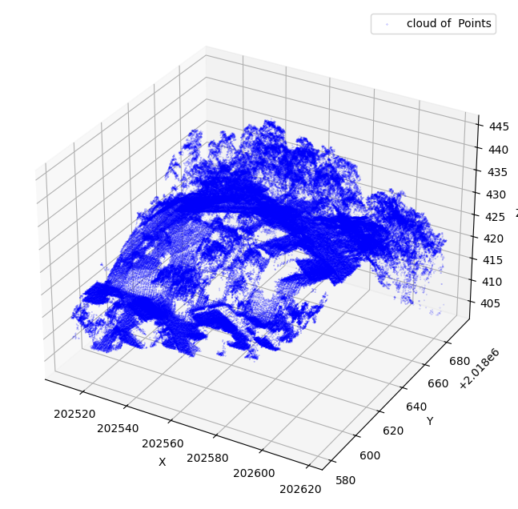
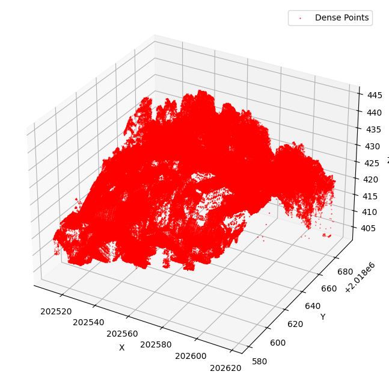

# Lidar Classification Project for University Assignment

This repository contains the code and data related to the Lidar Classification Project for a university assignment.

## Table of Contents

- [Introduction](#introduction)
- [Data Handling](#data-handling)
- [Data Visualization](#data-visualization)
- [Machine Learning Script](#machine-learning-script)

## Introduction

This project aims to identify objects based on the Esri Lidar classification using Python.

## Data Handling

In this part, I used the Laspy library for dealing with LAS data. LAS is a public file format meant to exchange 3D point data, mostly used to exchange lidar point clouds. LAZ is a lossless compression of the LAS format.

## Data Visualization

For visualization, I used two libraries: Matplotlib for static visualization and Plotly for dynamic visualization on the web.

- Point Cloud.

- Denser Point Cloud.

## Machine Learning Script

for this part i used sklearn library for machine learining operations .
by providing the classification i am aiming for the identification of the number / percentage of that classification in the provided area (I am still learining and trying the get better at this part ).
